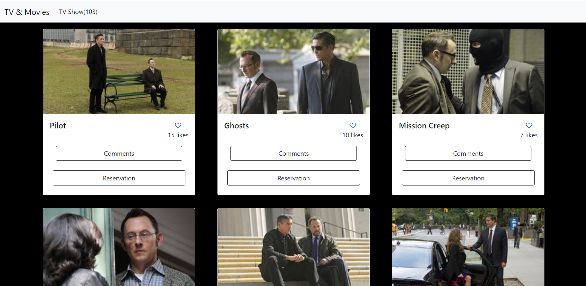

# TV show 
> This project for list the TV show. We build our own web application based on 2 external APIs, TVMAZE API and Microverse's Involvement API. We build the project using JavaScript, Bootstrap and Webpack.

## Built With

-  HTML, CSS, JavaScript
-  Visual Studio Code: A source code editor
-  Git: A tool for managing source code
-  Webpack

## Live Demo

[Live Demo Link](https://mustabbas.github.io/TvMovies/dist)

## Getting Started

Download the ZIP from this [Link](https://github.com/mustabbas/TvMovies.git), or run the following git command to clone the files to your machine:

git clone https://github.com/mustabbas/TvMovies.git
Once the files are on your machine, open the folder in Visual Studio Code.
Change directory cd into the just created from the project
To install dependencies use Run npm install
To start your project use npm run build

### Prerequisites
npm.
A web browser.

### Setup
Follow the steps described before.

## Authors

👤 **MUSTAFA ABBAS**

- GitHub: [@githubhandle](https://github.com/mustabbas)
- LinkedIn: [LinkedIn](https://www.linkedin.com/in/mustafa-abbas-7555ba10a)

👤 **Dico Diaz Dussan**

- GitHub: [@dicodiaz](https://github.com/dicodiaz)
- Twitter: [@DicoDiaz1](https://twitter.com/DicoDiaz1)
- LinkedIn: [Dico Diaz Dussan](https://www.linkedin.com/in/dico-diaz-dussan-476106a6/)

## 🤝 Contributing

Contributions, issues, and feature requests are welcome!

Feel free to check the [issues page](https://github.com/mustabbas/TvMovies/issues).

## Show your support

Give a ⭐️ if you like this project!

## 📝 License

This project is [MIT](./MIT.md) licensed.
